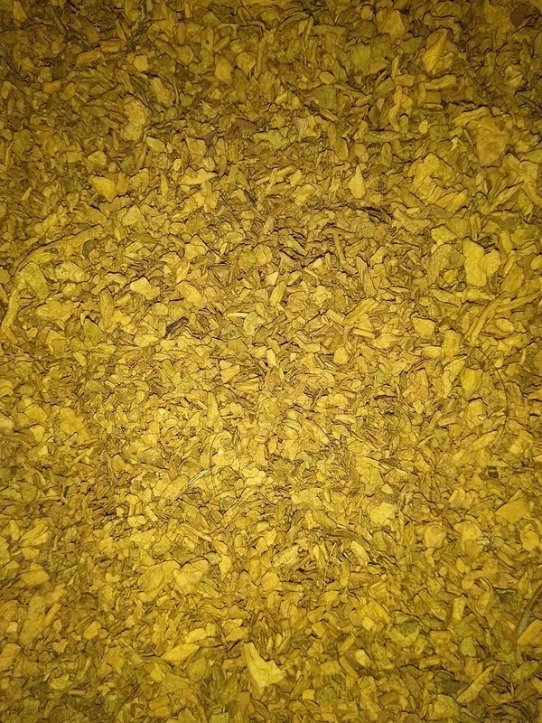
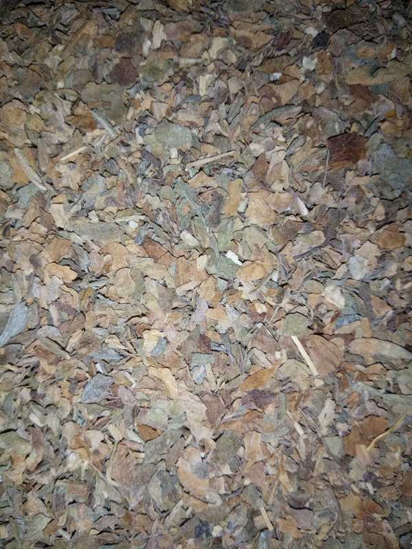
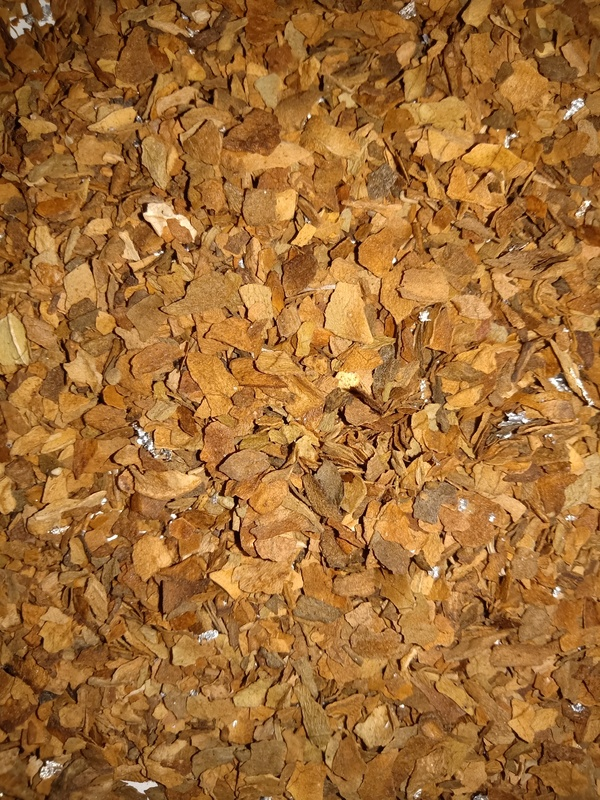
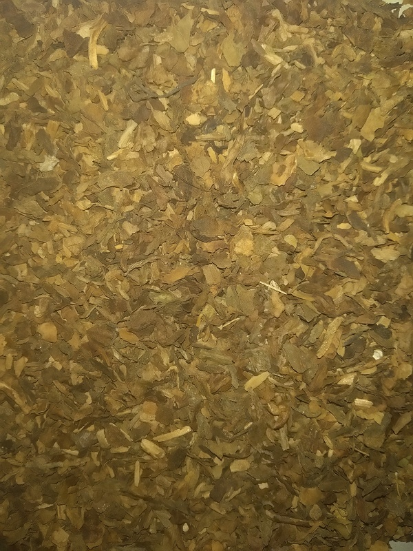
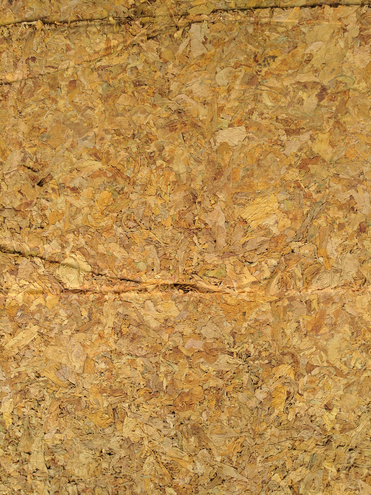
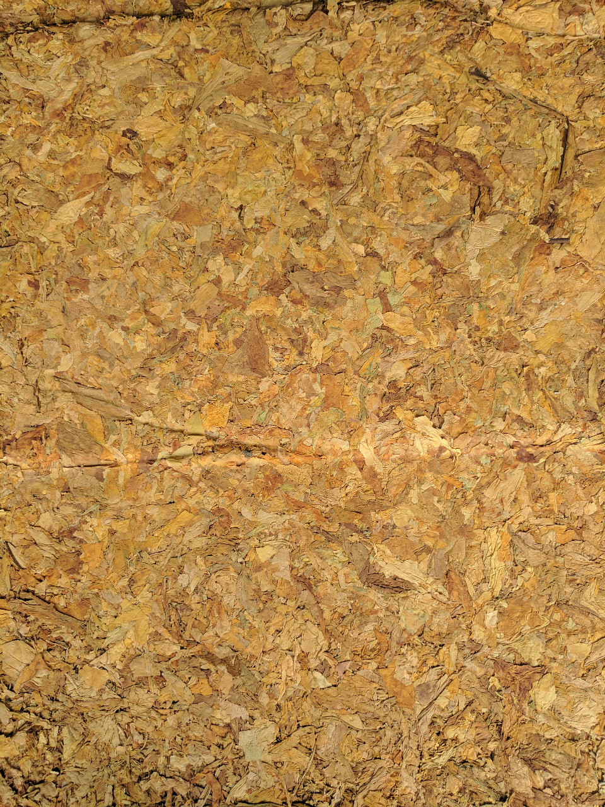
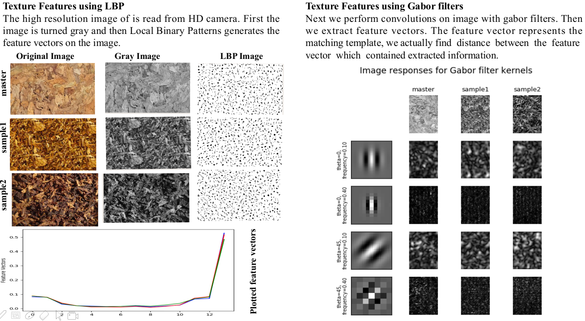
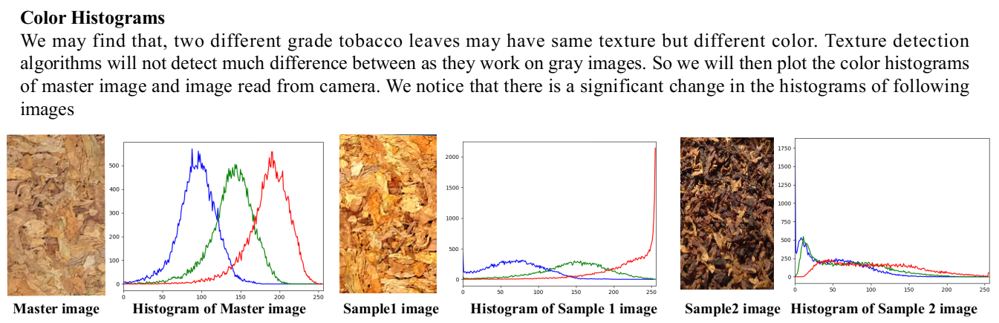
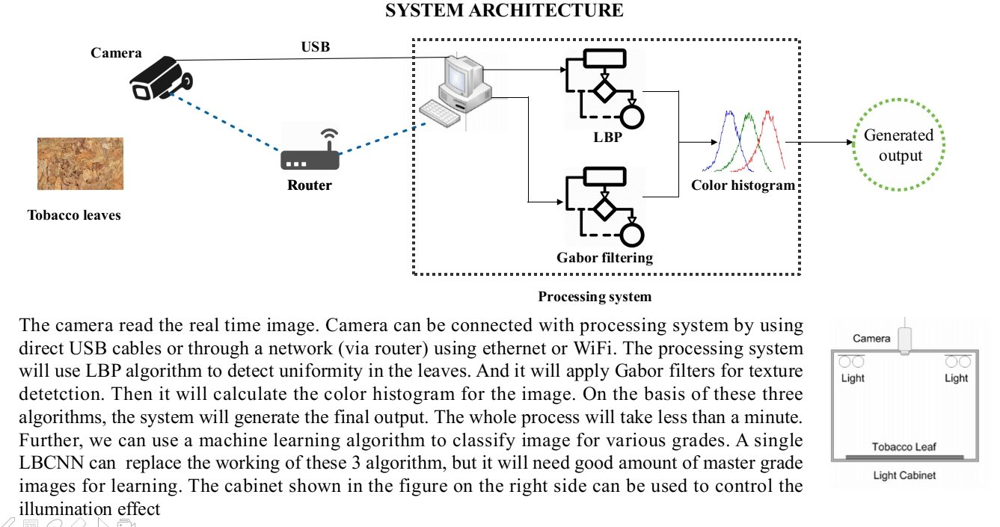

# ITC-Tobacoo
This repo contains code for the Smart India Hackathon 2019 project. Tobacco classification is a difficult problem, and only highly expert humans can correctly tell the grade of tobacco. This project is an effort to automate this process using an AI-based system. Our method predicts the grade of tobacco leaves using images based on color, texture, and ripeness. 

This project was built for ITC Ltd.

## Old implementation dataset

This dataset was easy as anyone can easily classify these images. No expertise needed.

 
 

Solution: Tensoflow based CNN to classify the images for various grades of the tobacco.

## New implementation dataset

This dataset is very difficult because each of these images belong to different tobacco grade.

 
 

Solution

Classical features were extracted from images  
1) Gabor
2) LBP
3) Haralik
4) Color RGB
5) Color HSV
6) GLCM
7) Orb
8) And many more ...

and a machine learning model was trained.

 

## Final System

